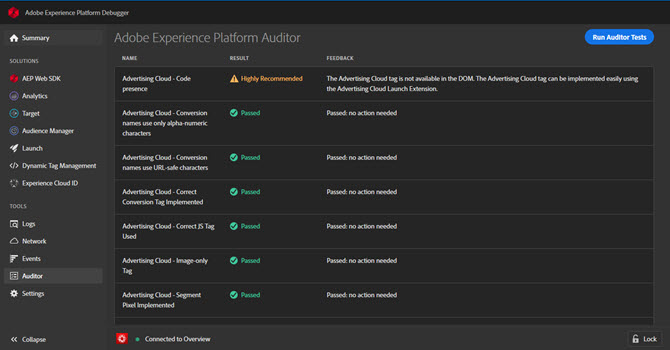

# Auditor {#auditor}

>[!IMPORTANT]
>
>Adobe Experience Cloud Cloud Debugger 2.0 is currently in beta. The documentation and the functionality are subject to change. 

You can use Adobe Experience Platform [Auditor](https://docs.adobe.com/content/help/en/auditor/using/overview.html) to run a series of audits on your page from the Auditor screen.

1. Click **[!UICONTROL Auditor]** in the left nav.
1. Click **[!UICONTROL Run Auditor Tests]**.

The test results display.

The results list shows the test and its result, and provides suggestions to resolve any issues.