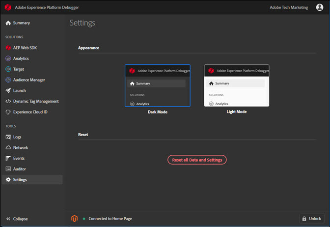

# Configure Debugger

>[!IMPORTANT]
>
>Adobe Experience Cloud Cloud Debugger 2.0 is currently in beta. The documentation and the functionality are subject to change. 

You can configure certain aspects of how Debugger looks and works.

## Light or dark mode

After Debugger opens, you can select your preferred appearance by going to **[!UICONTROL Settings]** and selecting either **Dark Mode** (default) or **Light Mode**.

## Reset

Click **[!UICONTROL Reset all Data and Settings]** to return to clear all data and return to the default settings.

## Lock Debugger on one page

As you change pages on your site, the Debugger window updates to show info for that page. The name of the page you're connected to shows at the bottom of the screen. To keep Debugger locked on one page, click **[!UICONTROL Lock]** in the bottom right corner of the Debugger window.

This is useful if you're reading documentation or viewing information on another page while debugging your page.