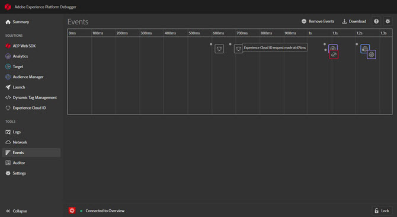
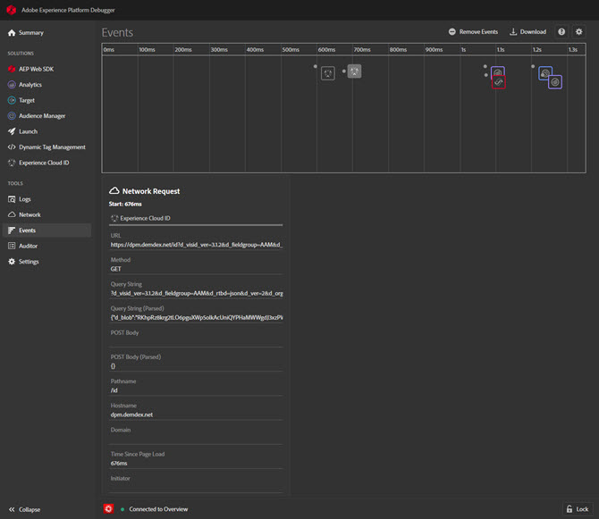
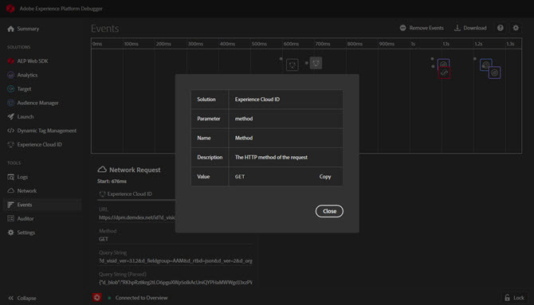

# Events{#events}

>[!IMPORTANT]
>
>Adobe Experience Cloud Cloud Debugger 2.0 is currently in beta. The documentation and the functionality are subject to change. 

The Events screen provides a graphical view of the events that occur, displayed on a timeline.

For each event, an icon for the applicable Experience Cloud solution appears on the timeline. Icons also show changes to the data layer (if enabled). Hover over an icon for a summary of the event. Click on the event for more details. You can Shift-Click or Control-Click to view multiple events.

Click on a detail for more information.

## Track data layer changes

To enable tracking data layer changes in the timeline: 

1. Click the Gear icon at the top right.
1. Enter the name of your data layer.

    

1. Click **[!UICONTROL Save]**.

The data layer change details show anything that has been deleted or added. You can click **{}** to look deeper into the data layer.

## Download event information

Click **[!UICONTROL Download]** to download an Excel file showing information about your page calls.