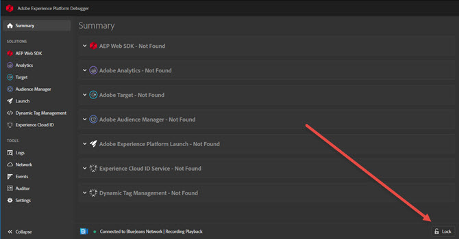

# Install Experience Cloud Debugger{#install-experience-cloud-debugger}

Download and install the Adobe Experience Cloud Debugger extension.

* **Chrome:** From the [Chrome extension page](https://chrome.google.com/webstore/detail/adobe-experience-cloud-de/ocdmogmohccmeicdhlhhgepeaijenapj)
* **Firefox:** From the [Firefox add-ons page](https://addons.mozilla.org/en-US/firefox/addon/adobe-experience-platform-dbg/)

After you install the extension, an icon is added to the extension bar:

<!-->>[!VIDEO](https://video.tv.adobe.com/v/23114t2/)--> 

Click the icon to start Debugger. 

After Debugger opens, you can select your preferred appearance by going to **<!UICONTROL Settings>** and selecting either **Dark Mode** (default) or **Light Mode**.

As you change pages on your site, the Debugger window updates to show info for that page. The name of the page you're connected to shows at the bottom of the screen. To keep Debugger locked on one page, click **[!UICONTROL Lock]** in the bottom right corner of the Debugger window.

This is useful if you're reading documentation or viewing information on another page while debugging yopur page.