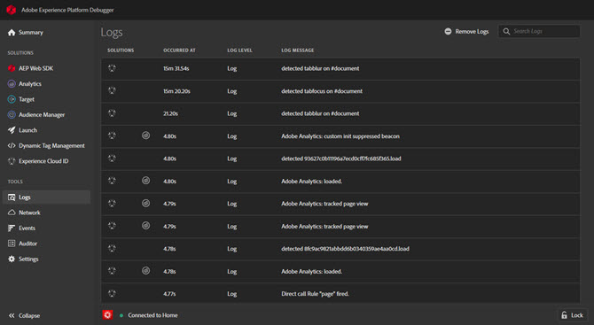

# Logs{#logs}

The Logs screen provides information specific to DTM implementations. The Console Debugging tool for DTM does not need to be enabled to show this information. You can filter by solutions implemented via their associated DTM tools. 

The Logs screen shows information in four columns:

**[!UICONTROL Solutions]:** Displays icons for the Experience Cloud solution affected by the logged item. Hover over the icon for a text description.

**[!UICONTROL Occurred at]:** Shows when the logged issue occured during the session.

**[!UICONTROL Log level]:** Shows the issue severity. The severity is one of the following levels: 

* Log 
* Info 
* Warnings 
* Errors

**[!UICONTROL Log message]:** Describes the issue.

Some log messages include a Show Code option. Click **[!UICONTROL Show Code]** to view the conditional code that determines whether a rule should fire. 

To clear the log, click **[!UICONTROL Remove Logs]**.
