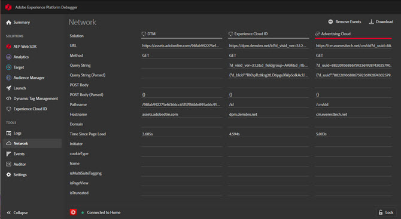
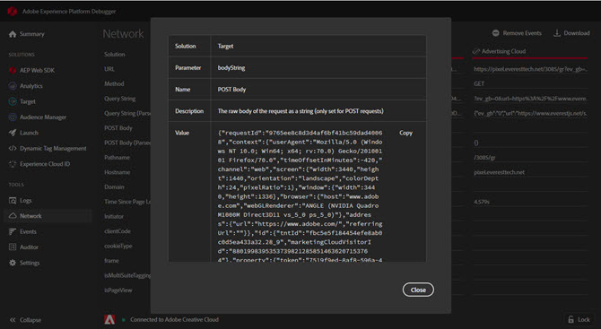

# Network{#network}

>[!IMPORTANT]
>
>Adobe Experience Cloud Cloud Debugger 2.0 is currently in beta. The documentation and the functionality are subject to change. 

To view Network information, click **[!UICONTROL Network]**.

The Network screen aggregates all of the Adobe Experience Cloud solution calls made on the page and displays them in order from left to right. Standard parameters are automatically labeled with friendly names and arranged to group common parameters on the same role.

This screen is useful for comparing key value pairs across hits. You can confirm that parameters used for integrations, such as the Experience Cloud Visitor ID or the Supplemental Data ID, are consistent across integrations.

>[!NOTE]
>
>At this time, not all parameters passed in the solution calls (for example, Analytics context variables, Target custom parameters, or Experience Cloud ID Service Customer IDs) are visible in the Network screen.

To change the information by solution, select the solution you want to view from the list in the left nav. The following example is filtered to show only Analytics:

To return to displaying all solutions, click **[!UICONTROL Network]**

Click on an item in the Network view to see an expanded view. From the expanded view window, you can copy the information shown to the Clipboard.

<!--Use the icon at the top of each column to copy the server call URL to your clipboard, where you can paste it into another document for reference or debugging purposes.

-->

To clear the list, click **[!UICONTROL Remove Events]**.

To download an Excel file containing the information on this screen, click **[!UICONTROL Download]**.