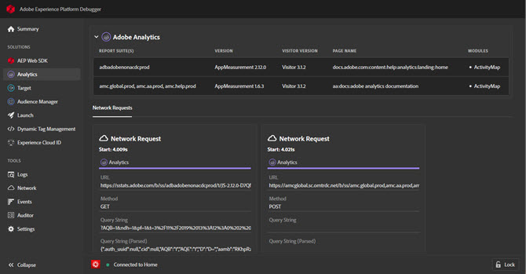

# Solutions{#solution-tabs}

> [!IMPORTANT]
>
> Adobe Experience Cloud Cloud Debugger 2.0 is currently in beta. The documentation and the functionality are subject to change. 

Click a solution to see the results for specific Adobe Experience Cloud solutions.

## AEP Web SDK {#aep}

The AEP Web SDK screen shows information about the Adobe Experience Platform Web SDK. Click **[!UICONTROL Configure]** to toggle console logging on or off.

## Analytics {#section-f71dfcc22bb44c86bec328491606a482}

The Analytics screen provides information about your [Analytics](https://docs.adobe.com/content/help/en/analytics/landing/home.html) implementation.

## Target {#section-988873ba5ede4317953193bd7ac5474c}

Use the Target screen to view [Target](https://docs.adobe.com/content/help/en/target/using/target-home.html) requests<!-- or [Mbox Trace](https://docs.adobe.com/content/help/en/target/using/activities/troubleshoot-activities/content-trouble.html) response details-->.

## Audience Manager {#section-1d4484f8b46f457f859ba88039a9a585}

Use the [Audience Manager](https://docs.adobe.com/content/help/en/audience-manager/user-guide/aam-home.html) tab to view details of [events](https://docs.adobe.com/content/help/en/audience-manager/user-guide/api-and-sdk-code/dcs/dcs-event-calls/dcs-event-calls.html). Click the organization to expand it and show the information.

## Launch {#section-ee80a9c509f2462c89c1e5bd8d05d7c8}

Use the Launch section to view Launch requests. You can also click **[!UICONTROL Configuration]** to configure [embed codes](https://docs.adobe.com/content/help/en/launch/using/reference/upgrade/link-dtm-embed-code.html). You can edit, replace, or add more embed codes from within Debugger. If you sign in, you can select an alternate property using the dropdowns.

## Dynamic Tag Management {#dynamic-tag-management}

Use the Dynamic Tag Management section to view DTM requests. You can also click **[!UICONTROL Configuration]** to configure [embed codes](https://docs.adobe.com/content/help/en/dtm/using/client-side/code.html).

## Experience Cloud ID Service {#section-a96c32f8e63a4991abb296f6e8ea01cf}

Use the Experience Cloud ID Service tab to view [Experience Cloud ID Service](https://docs.adobe.com/content/help/en/id-service/using/home.html) requests.